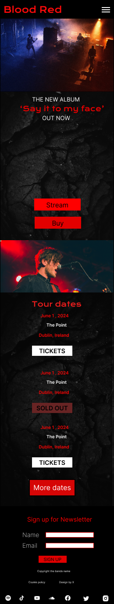
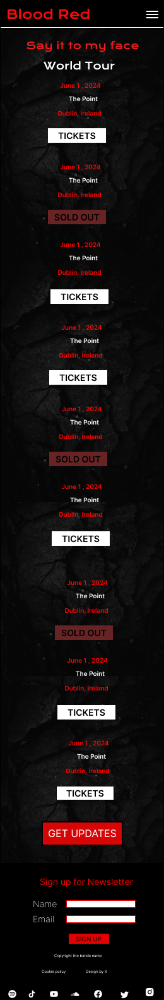
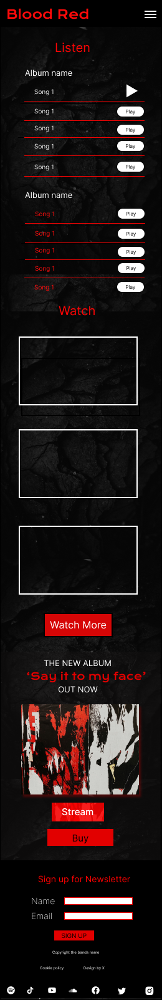
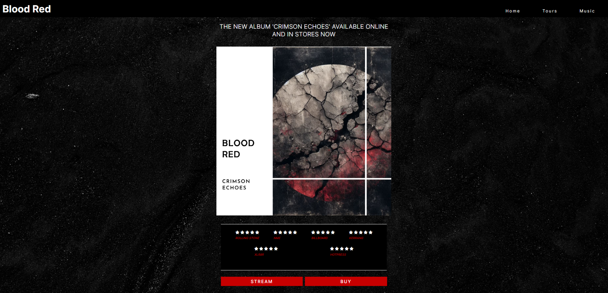
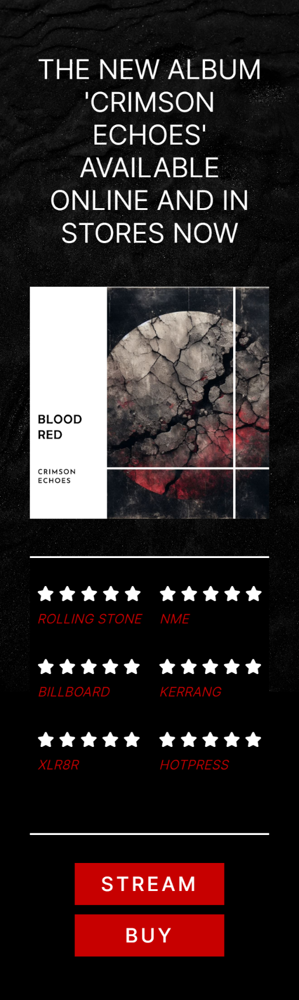

Links:

https://www.w3schools.com/html/html5_audio.asp
https://www.youtube.com/watch?v=vGHrJDmepI0
https://www.w3schools.com/howto/howto_js_alert.asp
https://www.shecodes.io/athena/39031-how-to-create-an-alert-after-clicking-a-button-using-javascript#:~:text=In%20this%20example%2C%20we%20add,message%20%22Button%20clicked!%22.
https://www.w3schools.com/cssref/sel_hover.php
https://uppbeat.io/

#   Blood Red
## Website for fictional rock band
### Portfolio Project 1 - Jamie Mcstay

## **[Live site](https://jamiemcstay.github.io/Project-1/)**

## **[Respository](https://github.com/jamiemcstay/Project-1)**

## Table of contents

1. [ Project planning](#planning)
2. [ Features](#features)
3. [ Technology](#technology)
4. [ Testing ](#testing)
5. [ Errors ](#errors)
6. [ Deployment ](#deployment)
7. [ Credits ](#credits)
8. [ Content ](#content)
9. [ Acknowledgments ](#acknowledgements)

## Project Planning

>I decided to make a website on a fictional rock band and did some research into some popular bands and how their websites looked.

After researching I began a UX design plan that was in line with what I had seen across numerous of the websites that I had reviewed.

## UX Strategy

### Website visitors

- Are existing fans of the band.
- Are visiting the website to learn more about the band and are potential fans.
-  Want to be able to hear about tour schedule.
- Want to be to have access to the bands music.
- Want updates on anything new that happens with the band.

### Musicians/Bands

-  Want to promote promote their music.
-  Want to promote their touring schedules.
-  Want to increase their fanbase and listener base.
-  Want to keep vistors/fans updated in anything happening with the band. 

## Scope

- The website should contain a navigation menu, main content areas on each page and a footer.
- It should contain an area that promotes new music. 
- There should be some imagery of the band on the website.
- There should be information on the website about touring schedule.
- Visitors should be able to listen to the bands music.
- There should be a way that fans can opt in to more integrate themselves within the bands community.

## Structure

I decided that the scope of the project could be met with three pages on the website:

- Home
- Tours
- Music

Across all pages as is consistent on websites, there will be a consistent header with responsive naviagation bar, a main content area, and a footer that contains a form where fans can sign up to a newsletter. 

### Homepage

- Should serve as a summary of where the band are at currently and the most recents developments as a band.
- Should contain a welcome section/hero section that highlights the most recent development the band would like to promote in the context of a new album release or a tour. 
- Should contain some imagery of the band. 

### Tours

- Will serve as a page where visotors can view tour dates, check availability of ticktets, and be able to buy tickets for upcoming shows. 

### Music

- Will allow visitors to be able to listen to the music of the band.
- Will allow visitors to watch videos of the band. 

## Skeleton

I used figma to build a wireframes of the different pages on the site. I decided to design the website mobile first.  

### Homepage

- Will feature an initial section thats promotes the most recent update about the band such as an album release or upcoming tour.
- Will feature some imagery of the band.
- Will feature a couple of tour dates with a link to the tours page where more dates can be seen. 

### Tours page
- Will feature a list of upcoming tour dates locations, dates and options to purchase tickets.

### Music page

- Will feature some of the bands music that the visitors can listen to.
- Will feature some videos of the band that the visitor can watch. 

## Surface

### Typography 

When designing the surface plane in figma, I had used
- Krona 1 font
- Inter

However, when making the real website I preferred the look of inter as a font on its own, so I used that soley.

### Color

To allow for the site to meet the requirments in terms of accessibity and having a good contrast ratio, I opted to use colors that I knew would stand out from each: 
- Black 
- Red (or eventually rgb(180, 0, 0))
- White. 

#### Homepage

 

#### Tours page

#### Music page

## Features

### index.html 

#### Navigation menu

>The navigation bar was developed mobile first following the tutorial in the Love running project to create a hamburger menu on smaller screens. Flex was used to space out the navigation menu items on larger screens. 

##### Desktop 

##### Mobile

#### Album release section

>The album release release section was to show some cover art of the new album release of the band, some reviews from popular editorials, and some links where visitors can stream or buy the record. The design moved on from my initial design as seen in my figma designs. I uses microsoft image generator and open art AI to bring together an album cover that suited the design of the website. 

##### Desktop

##### Modile

#### Singer Image

>I wanted to break up the sections of content on the homepage, and as I had seen on multiple other band websites there had been imagery of the band on the site. So, I found an image on unsplash that I used. However, when enlarged the image was pixilated and didn't look right. I then processed the image through the open art AI application that sharpened the image, and changed the singer from male to female, and then fullfilled its purpose on the homepage. 

#### Tours section on Home Page

>I had seen a lot of other websites that had a few tour dates on the homepage that would then link to a page or external site where an entire touring schedule could be reviewed by the visitor, so I included that as the second section on the homepage. The tour dates information was in a column in mobile and using flex those columns were changed to rows to fill the surplus space. 

##### Desktop

##### Mobile

#### Footer 

>The main purpose of the footer in this website was to provide links to social media and a form for the visitor to subscribe to a newsletter. Also, I included some links that are standard in terms of a copyright tag,  a link to the designers webpage, and a link to the  cookie policy.

##### Desktop

##### Mobile

### tours.html

>The tours page was to inlcude more dates than are featured on the homepage. In order to vary the aesthetic of the site and offer some variation between the pages I used the image from the homepage and fixed it to the background.

##### Desktop

##### Mobile

### music.html

>The music page was to feature a section for listening and for watchin videos of the band. Given that Blood Red are a fictional band, I obviously didn't have original audio and video files, or actual an actual spotify/youtube account that I could use to embed songs or videos from.  As an alternative I used audio files that I downloaded from Uppbeat.io and used audio elements to feature them on the page. Then, I embedded some youtube videos of other bands.

#### Listen Section

The listen section features an album and single with cover art for both, and a list of the relative songs for each release. I set a max-width on the container for this listen section, and then had it set to wrap so it would appear as a column on smaller screens. 

I would have preferred to have been able to style the audio controls such as the play button and playback bar, however this is not possible with audio elements. I think it would have suited the aethetic of the website if there was some red, white and black in these audio elements, and would be noted if building a similar site again. 

##### Desktop

##### Mobile

#### Watch Section 

The watch section allows users to watch music videos of the band. I inlcuded four videos and a button/link below where the user can visit the youtube page of the band. Similar to the listen section the container for the watch section is set to wrap, so there are rows of two videos on desktops on in a column on mobile devices. 

##### Desktop 

##### Mobile

 

