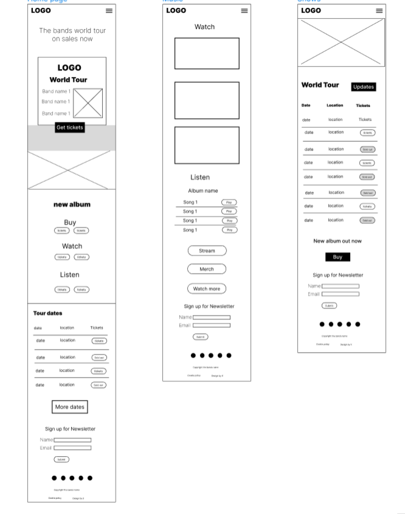

Links:

https://www.w3schools.com/html/html5_audio.asp
https://www.youtube.com/watch?v=vGHrJDmepI0
https://www.w3schools.com/howto/howto_js_alert.asp
https://www.shecodes.io/athena/39031-how-to-create-an-alert-after-clicking-a-button-using-javascript#:~:text=In%20this%20example%2C%20we%20add,message%20%22Button%20clicked!%22.
https://www.w3schools.com/cssref/sel_hover.php

#   Blood Red
## Website for fictional rock band
### Portfolio Project 1 - Jamie Mcstay

## **[Live site](https://jamiemcstay.github.io/Project-1/)**

## **[Respository](https://github.com/jamiemcstay/Project-1)**

## Table of contents

1. [ Project planning](#planning)
2. [ Features](#features)
3. [ Technology](#technology)
4. [Testing](#testing)
5. [Errors](#errors)
6. [Deployment](#deployment)
7. [Credits](#credits)
8. [Content](#content)
9.[Acknowledgments](#acknowledgements)

## Project Planning

>I decided to make a website on a fictional rock band and did some research into some popular bands and how their websites looked.

After researching I began a UX design plan that was in line with what I had seen across numerous of the websites that I had reviewed.

## Strategy

### Website visitors

> Are existing fans of the band.
> Are visiting the website to learn more about the band and are potential fans.
> Want to be able to hear about tour schedule.
> Want to be to have access to the bands music.
> Want updates on anything new that happens with the band.

### Musicians/Bands

-  Want to promote promote their music.
-  Want to promote their touring schedules.
-  Want to increase their fanbase and listener base.
-  Want to keep vistors/fans updated in anything happening with the band. 

## Scope

- The website should contain a navigation menu, main content areas on each page and a footer.
- It should contain an area that promotes new music. 
- There should be some imagery of the band on the website.
- There should be information on the website about touring schedule.
- Visitors should be able to listen to the bands music.
- There should be a way that fans can opt in to more integrate themselves within the bands community.

## Structure

I decided that the scope of the project could be met with three pages on the website:

- Home
- Tours
- Music

Across all pages as is consistent on websites, there will be a consistent header with responsive naviagation bar, a main content area, and a footer that contains a form where fans can sign up to a newsletter. 

### Homepage

- Should serve as a summary of where the band are at currently and the most recents developments as a band.
- Should contain a welcome section/hero section that highlights the most recent development the band would like to promote in the context of a new album release or a tour. 
- Should contain some imagery of the band. 

### Tours

- Will serve as a page where visotors can view tour dates, check availability of ticktets, and be able to buy tickets for upcoming shows. 

### Music

- Will allow visitors to be able to listen to the music of the band.
- Will allow visitors to watch videos of the band. 

## Skeleton

I used figma to build a wireframes of the different pages on the site. 

### Homepage

- Should contain

 

