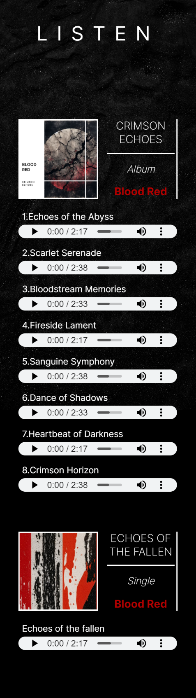

Links:

https://www.w3schools.com/html/html5_audio.asp
https://www.youtube.com/watch?v=vGHrJDmepI0
https://www.w3schools.com/howto/howto_js_alert.asp
https://www.shecodes.io/athena/39031-how-to-create-an-alert-after-clicking-a-button-using-javascript#:~:text=In%20this%20example%2C%20we%20add,message%20%22Button%20clicked!%22.
https://www.w3schools.com/cssref/sel_hover.php
https://uppbeat.io/
https://www.flaticon.com/free-icon/blood-drop_893529?term=blood+drop&page=1&position=5&origin=search&related_id=893529
https://web.dev/articles/apply-instant-loading-with-prpl

#   Blood Red
## Website for fictional rock band
### Portfolio Project 1 - Jamie Mcstay

## **[Live site](https://jamiemcstay.github.io/Project-1/)**

## **[Respository](https://github.com/jamiemcstay/Project-1)**

## Table of contents

1. [ Project planning](#planning)
2. [ Features](#features)
3. [ Technology](#technology)
4. [ Testing ](#testing)
5. [ Errors ](#errors)
6. [ Deployment ](#deployment)
7. [ Credits ](#credits)
8. [ Content ](#content)
9. [ Acknowledgments ](#acknowledgements)

## Project Planning

>I decided to make a website on a fictional rock band and did some research into some popular bands and how their websites looked.

After researching I began a UX design plan that was in line with what I had seen across numerous of the websites that I had reviewed.

## UX Strategy

### Website visitors

- Are existing fans of the band.
- Are visiting the website to learn more about the band or they are potential fans.
- Want to be able to hear about the bands touring schedule.
- Want to be to have access to the bands music.
- Want updates on anything new that happens with the band.

### Musicians/Bands

-  Want to promote their music.
-  Want to promote their touring schedules.
-  Want to increase their fanbase and listener base.
-  Want to keep vistors/fans updated in anything happening with the band. 

## Scope

- The website should contain a navigation menu, main content areas on each page and a footer.
- It should contain an area that promotes new music. 
- There should be some imagery of the band on the website.
- There should be information on the website about touring schedule.
- Visitors should be able to listen to the bands music.
- There should be a way that existing fans can opt-in to more integrate themselves within the bands community, and where new fans can sign up to learn more about the band. 

## Structure

I decided that the scope of the project could be met with three pages on the website:

- Home
- Tours
- Music

Across all pages as is consistent on websites, there will be a consistent header with responsive naviagation bar, a main content area, and a footer that contains a form where fans can sign up to a newsletter. 

### Homepage

- Should serve as a summary of where the band are at currently and the most recents developments as a band.
- Should contain a welcome section/hero section that highlights the most recent development the band would like to promote in the context of a new album release, or a tour. 
- Should contain some imagery of the band. 

### Tours

- Will serve as a page where visotors can view tour dates, check availability of ticktets, and be able to buy tickets for upcoming shows. 

### Music

- Will allow visitors to be able to listen to the music of the band.
- Will allow visitors to watch videos of the band. 

## Skeleton

I used figma to build a wireframes of the different pages on the site. I decided to design the website mobile first.  

### Homepage

- Will feature an initial section thats promotes the most recent update about the band such as an album release or upcoming tour.
- Will feature some imagery of the band.
- Will feature a couple of tour dates with a link to the tours page where more dates can be seen. 

### Tours page
- Will feature a list of upcoming tour dates locations, dates and ability to purchase tickets.

### Music page

- Will feature some of the bands music that the visitors can listen to.
- Will feature some videos of the band that the visitor can watch. 

## Surface

### Typography 

When designing the surface plane in figma, I had used: 
- Krona 1 font
- Inter

However, when making the real website I preferred the look of inter as a font on its own, so I used that soley.

### Color

To allow for the site to meet the requirments in terms of accessibity and having a good contrast ratio, I opted to use colors that I knew would stand contrast eachother: 
- Black 
- Red (or eventually rgb(199, 0, 0))
- White. 

#### Homepage

 

#### Tours page

#### Music page

## Features

### index.html 

#### Navigation menu

>The navigation bar was developed mobile first following the tutorial in the Love running project to create a hamburger menu on smaller screens. Flex was used to space out the navigation menu items on larger screens. 

##### Desktop 

##### Mobile

#### Album release section

>The album release release section was to show some cover art of the new album release of the band, some reviews from popular editorials, and some links where visitors can stream or buy the record. The design moved on from my initial design as can be seen in my figma designs. I used microsoft image generator and open art AI to bring together an album cover that suited the look of the website. 

##### Desktop

##### Mobile

#### Singer Image

>I wanted to break up the sections of content on the homepage, and as I had seen on multiple other band websites there had been imagery of the band on the site that can create a sense of familiarity with with the fans/users. 

I found an image on unsplash that I used for this purpose. However, when enlarged the image was pixilated and didn't look right. I then processed the image through the open art AI application that sharpened the image, and changed the singer from male to female, and then fullfilled its purpose on the homepage. 

#### Tours section on Home Page

>This section is a summary of the main tours page, but can entice a user who is interested in going to a show to purchase a ticket, or click the more dates button and view all the dates of upcoming shows.

The tour dates information is a flex column on mobile and using flex and changed to rows to fill the surplus space on larger screens. 

##### Desktop

##### Mobile

#### Footer 

>The main purpose of the footer in this website was to provide links to social media and a form for the visitor to subscribe to a newsletter, and keep up to date with touring schedules, new releases, and any developments that happen with the band. 

Also, I included some links that are standard in terms of a copyright tag,  a link to the designers webpage, and a link to the  cookie policy.

##### Desktop

##### Mobile

### tours.html

>The tours page was to inlcude more dates than are featured on the homepage. 

In order to vary the aesthetic of the site and offer some variation between the pages I used the image from the homepage and fixed it to the background. Also, as a user/fan this would again create a sense of famility with the lead singer and the band. 

##### Desktop

##### Mobile

### music.html

>The music page features a section for listening and for watching videos of the band.
Given that Blood Red are a fictional band, I didn't have original audio and video files, or actual an actual spotify/YouTube account that I could use to embed songs or videos from.  As an alternative I used audio files that I downloaded from Uppbeat.io and used audio elements to feature them on the page. Then, I embedded some youtube videos of other bands.

#### Listen Section

The listen section features an album and single with cover art for both, and a list of the relative songs for each release. I set a flex container for this listen section to wrap so it would appear as a column on smaller screens. This section provides value to the user as they can listen to new records, and if they like what they hear back opt to purchase the record. 

I would have preferred to have been able to style the audio controls such as the play button and playback bar, however this is not possible with audio elements. 

I think it would have suited the aethetic of the website if there was some red, white and black in these audio elements, and would be noted if building a similar site again. 

##### Desktop

##### Mobile

#### Watch Section 

The watch section allows users to watch music videos of the band. I inlcuded four videos and a button/link below where the user can visit the youtube page of the band.

Similar to the listen section there is a flex container for the watch section set to wrap, so there are rows of two videos on desktops, and videos in a single column on mobile devices.

This section again provides value to the user by being able to watch videos of their favourite songs or discover new music, and be linked to the bands youtube account through the watch more button to listen further. 

##### Desktop 

##### Mobile

### response.html 

Once the user enters their information correctly into the inputs of the 'Subscribe to newsletter' form in the footer, they are redirected to response.html which recognises their submission, and offers them a free download of a new single.

This will give the user clarificaiton that their information has been recieved and that they are in fact signed up to the newsletter, as well as please them by offering them a gift of sorts. 

Also, I added some buttons that the user can click to download the single, return to the homepage, or to the bands page of spotify. 

##### Desktop

#### Mobile

### Features left to implemenent

In future, features that could be added to improve the site could be:

#### Store

If revisiting this project I would like to add a store where users can buy merch such as physical records or branded clothes. 

#### Gallery

With some further research more pictures that are suitable could be found and a gallery page built around those images to create a realistic image of the band. 

#### 

Taking influence from some other bands a brief history of the band could be created, and a suitable about page be built around that story. 

## Technology

### Figma 

>I used figma to develop my designs for the web pages. 

### Html

>I used html to build the structure of the webpages.

### css

>I used css to add style to the front end of the website. 

### Github

> I used github to host my websites code. 

### Gitpod

>I used gitpod as my IDE to write my code.

### Git 

>Git was used as version control of the site. 

### Google Fonts

>I imported the inter font into my project to use on the website. 

### Font Awesome 

### TinyPNG 

I used TinyPNG to compress my images and optimize for the website. 

### Microsoft AI image Generator

I used this generator to generate images for an album cover. 

### Open Art AI 

I used this to generate images for the website. 

## Testing 

To test the websites functionity and responsive across different browsers I checked on: 

- Google Chrome
- Microsoft Edge
- Mozilla Firefox
- Safari 

#### Responsiveness

Throughout the development process I used dev tools in Google Chrome to test the sites responsiveness across different screen sizes. 

#### Third party testing

My three housemates were sent the link to the site and asked to:

- Click on every link/button. 
- Play the audio files.
- Enter their information into the form in the footer. 

They reported that it was intuitive, all the links worked, and the form responded as it should. 

### Google Lighthouse

When testing the score for the website through Google Lighthouse. I encountered an issue with my site being slow on the performance metric.

To fix thi: 

- I tidied up my CSS file and deleted any unused images from the images folder. 

- Removed the src element from all but but the first three audio tracks/elements on the listen page, so please not that only they are playable.

- Re-exported all my image files from figma, which resulted in a degredation of quality, but will massively improve the experience for the user.

>These fixes resulted in a score of 27%-31% on all pages to to between 80%-95% across all pages. 

#### index.html

### Bugs 

remove iframes

Move main down below and push footer down with flex

 

